# DigiMart - Digital Marketplace

A full-featured digital marketplace platform where users can browse, purchase, and sell digital products. Built with Laravel 11, Tailwind CSS, and Alpine.js.

## Features

### Buyer Features
- Browse and search digital products by category
- Shopping cart and secure checkout
- Multiple payment gateways (Stripe, Razorpay, PayPal)
- Product reviews and comments
- User profile management

### Author/Seller Features
- Upload and manage digital products
- Track sales and transactions
- Withdraw earnings with configurable methods
- Version history and changelogs for products
- KYC verification workflow

### Admin Panel
- Role-based access control (Spatie Permissions)
- Content management (hero sections, banners, custom pages)
- Order and transaction management
- Product review queue (approve/reject submissions)
- Withdrawal request processing
- Newsletter management
- Site-wide settings (commission rates, payment configs, SMTP, branding)

## Screenshots

### Frontend

#### Homepage


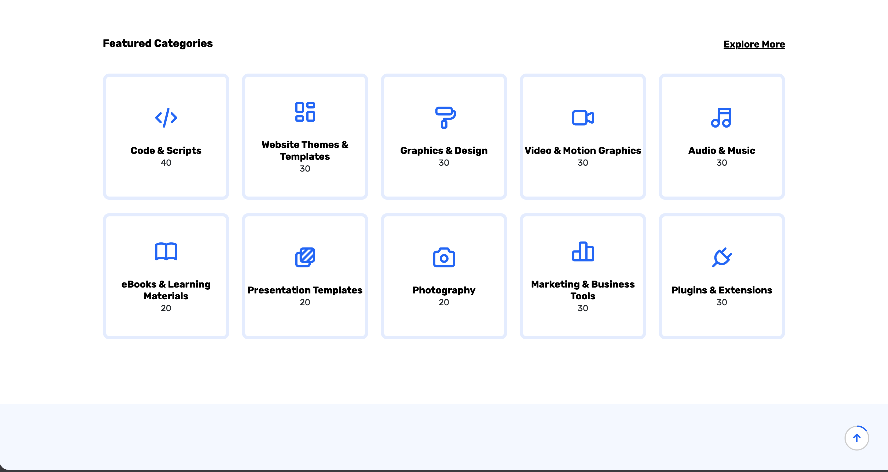


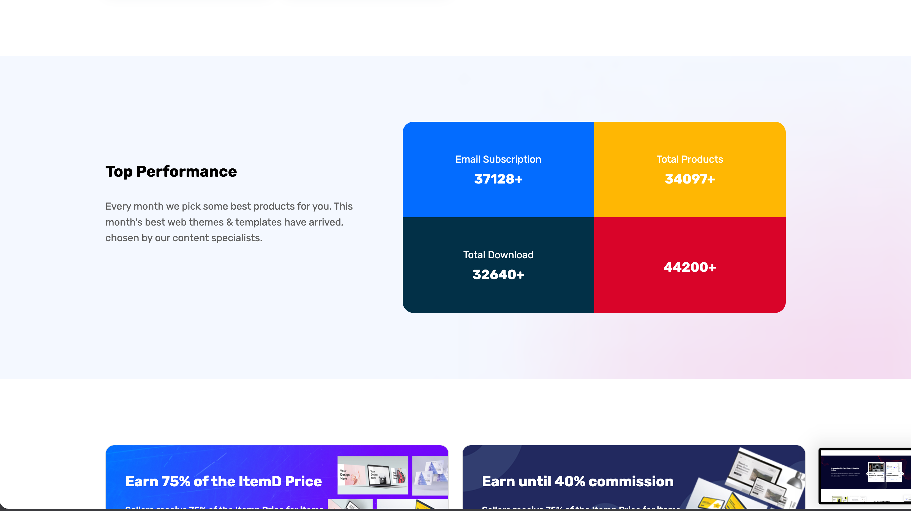

#### Products & Detail


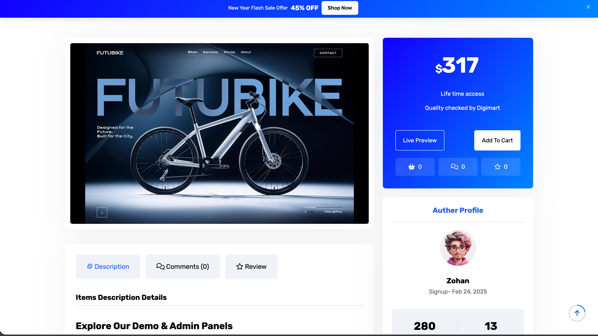

### Admin Panel

<details>
<summary>Dashboard</summary>

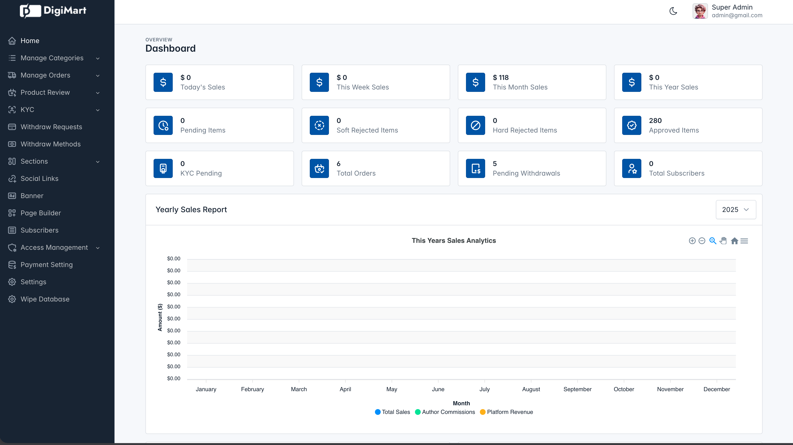
</details>

<details>
<summary>Category Management</summary>

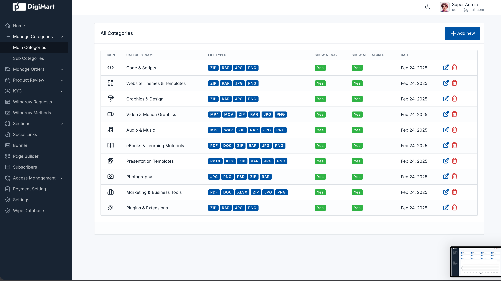

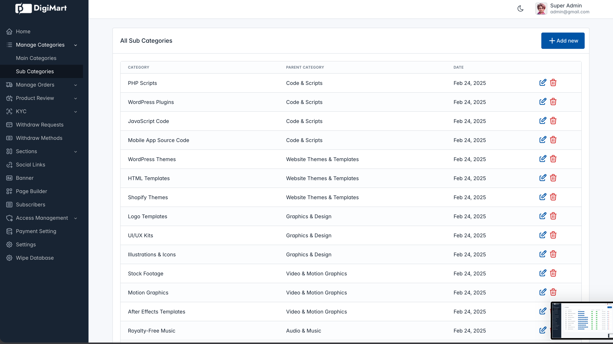
</details>

<details>
<summary>Order Management</summary>

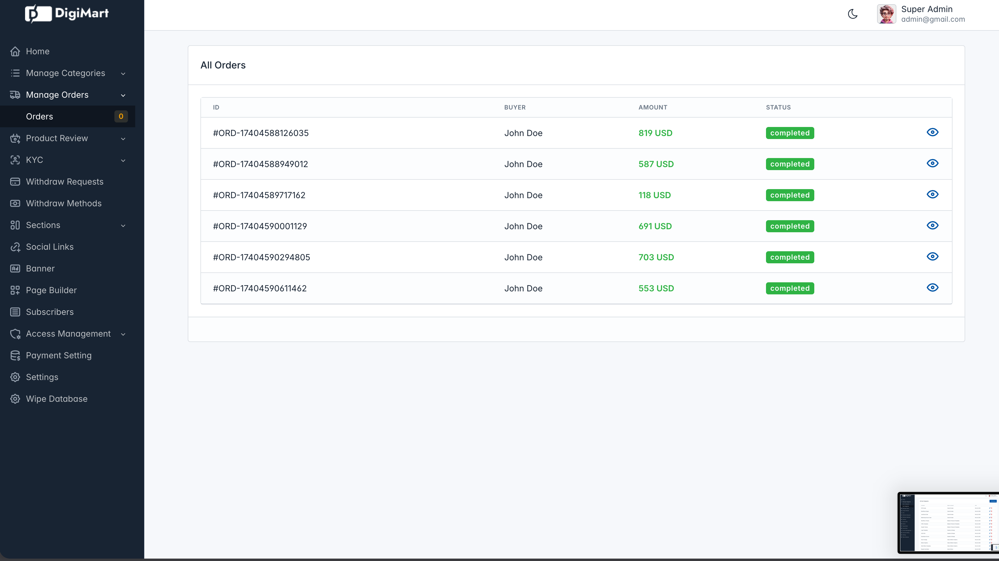
</details>

<details>
<summary>Product Review Queue</summary>

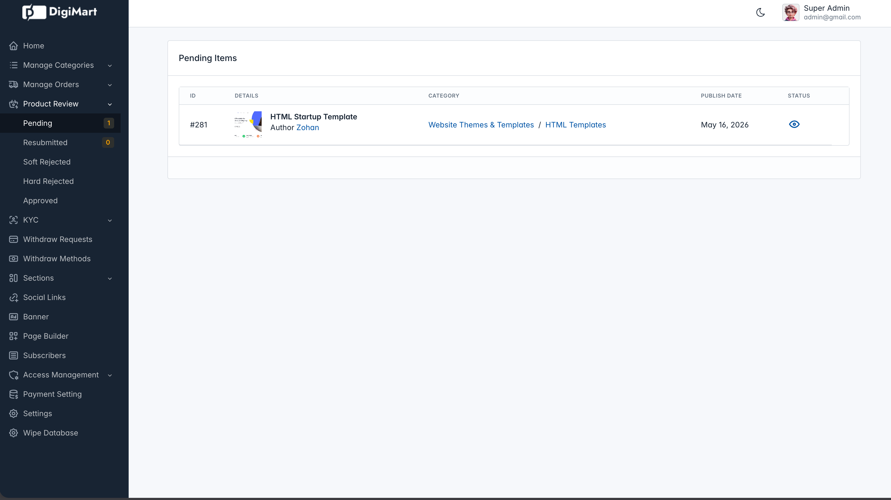
</details>

<details>
<summary>Withdrawal Management</summary>

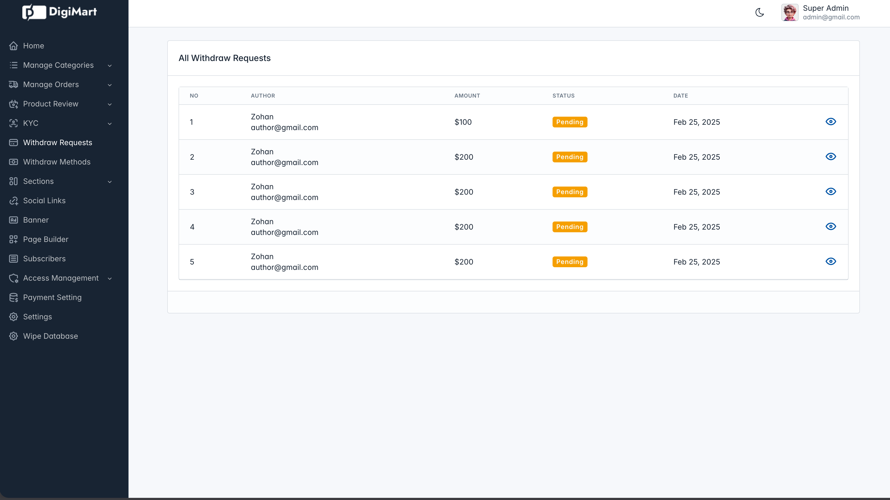

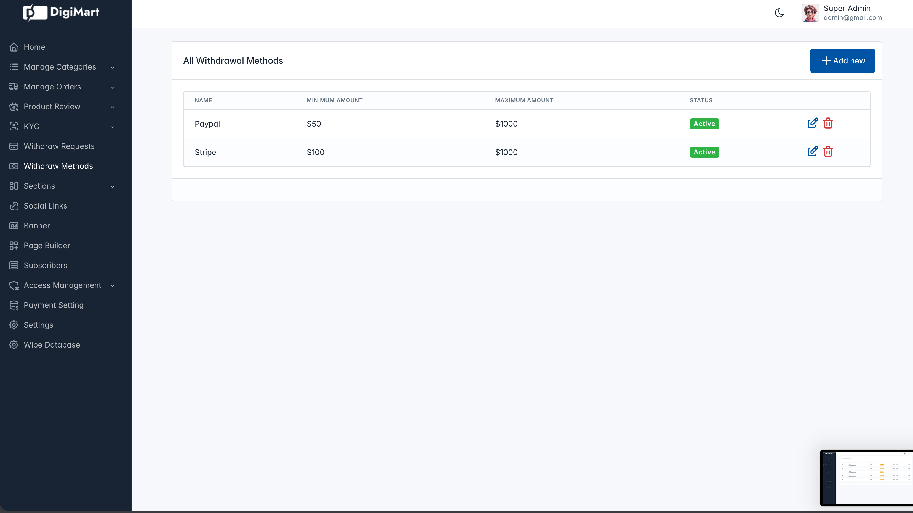
</details>

<details>
<summary>Content Management (Sections, Pages, Banners)</summary>

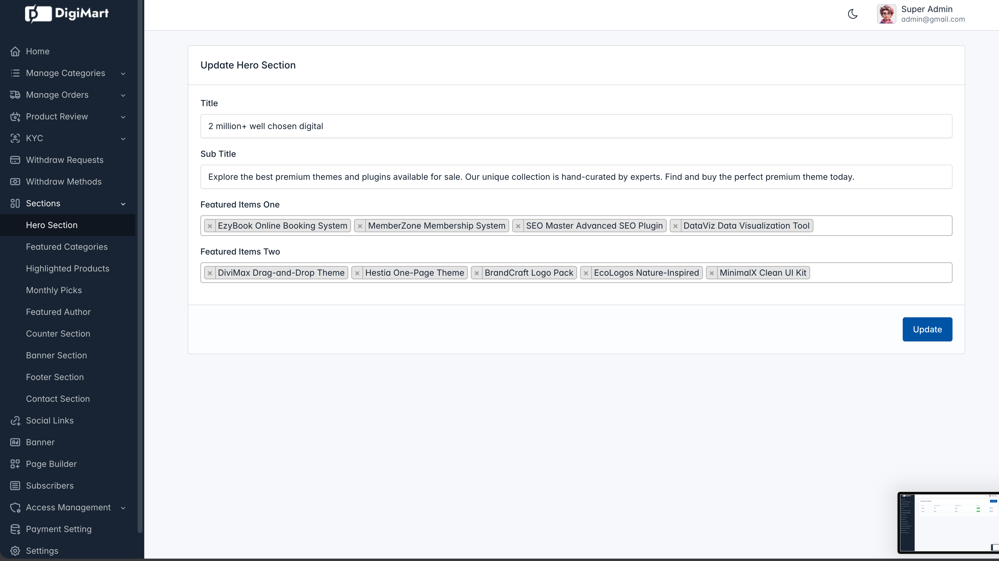

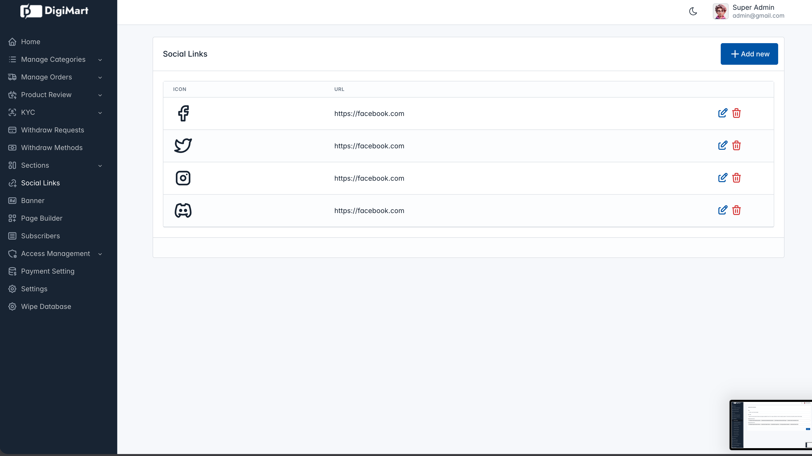

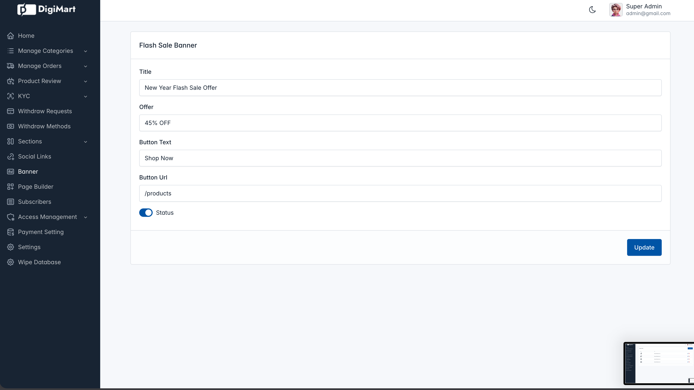

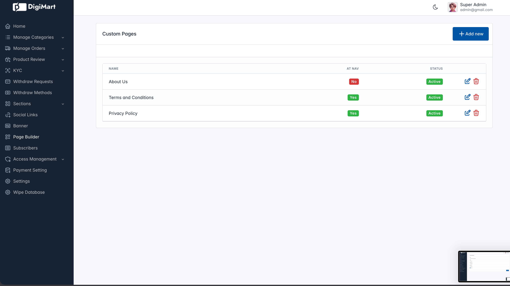
</details>

<details>
<summary>Access Control & Settings</summary>

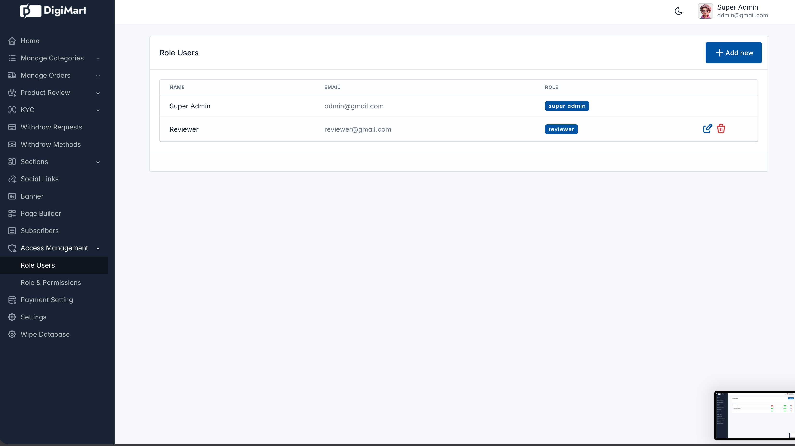

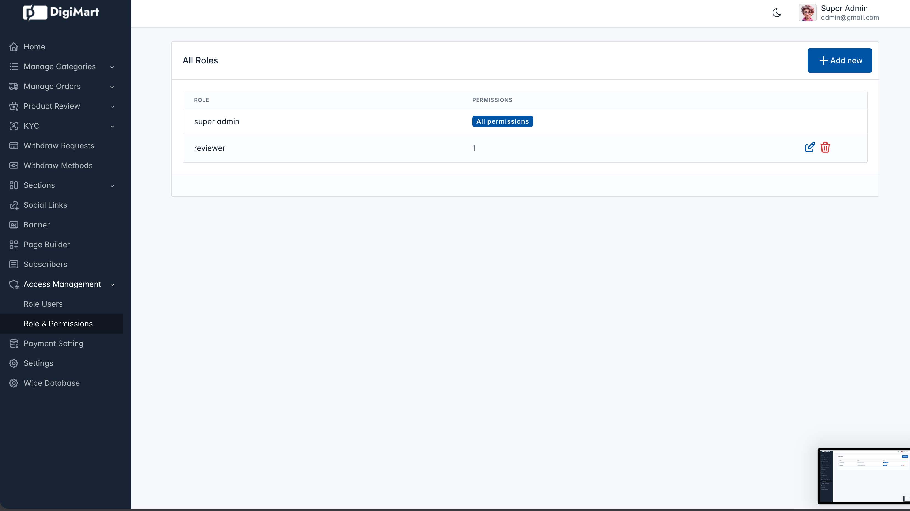

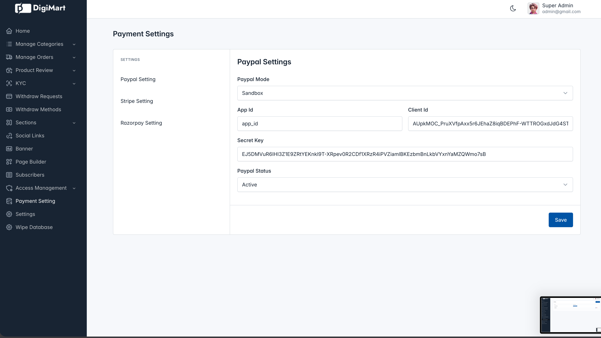

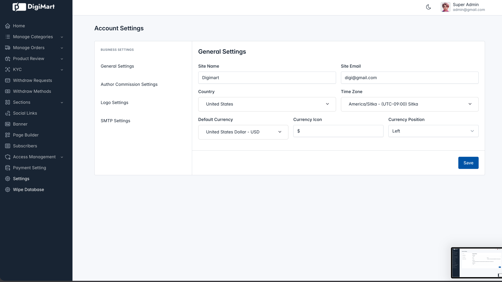
</details>

## Tech Stack

| Layer | Technology |
|-------|-----------|
| Backend | Laravel 11 (PHP 8.2+) |
| Frontend | Blade, Tailwind CSS 3, Alpine.js 3 |
| Database | MySQL |
| Auth | Laravel Breeze |
| Payments | Stripe, Razorpay, PayPal |
| Build Tool | Vite 6 |
| Testing | Pest PHP |

## Requirements

- PHP 8.2+
- Composer
- Node.js & npm
- MySQL

## Installation

1. **Clone the repository**

   ```bash
   git clone https://github.com/your-username/digimaart.git
   cd digimaart
   ```

2. **Install dependencies**

   ```bash
   composer install
   npm install
   ```

3. **Environment setup**

   ```bash
   cp .env.example .env
   php artisan key:generate
   ```

4. **Configure your `.env` file**

   Set your database credentials, mail settings, and payment gateway keys:

   ```env
   DB_DATABASE=digimaart
   DB_USERNAME=root
   DB_PASSWORD=

   STRIPE_KEY=your_stripe_key
   STRIPE_SECRET=your_stripe_secret

   RAZORPAY_KEY=your_razorpay_key
   RAZORPAY_SECRET=your_razorpay_secret

   PAYPAL_CLIENT_ID=your_paypal_client_id
   PAYPAL_SECRET=your_paypal_secret
   ```

5. **Run migrations and seed the database**

   ```bash
   php artisan migrate --seed
   ```

6. **Start the development server**

   ```bash
   npm run dev
   ```

   This concurrently runs the PHP server, queue listener, and Vite dev server.

## Project Structure

```
app/
├── Http/Controllers/
│   ├── Admin/          # Admin panel controllers
│   └── Frontend/       # Public-facing controllers
├── Models/             # Eloquent models
├── Mail/               # Mailable classes
├── Services/           # Business logic
├── Traits/             # Reusable traits (FileUpload)
└── Helpers/            # Global helper functions
routes/
├── web.php             # Frontend routes
├── admin.php           # Admin routes
└── auth.php            # Auth routes
resources/views/        # Blade templates
database/migrations/    # Database migrations
```

## Payment Gateways

The platform supports three payment processors out of the box:

- **Stripe** - Credit/debit card payments
- **Razorpay** - Popular in India
- **PayPal** - Global payments

Payment settings are configurable from the admin panel.

## License

This project is open-sourced software licensed under the [MIT license](LICENSE).
